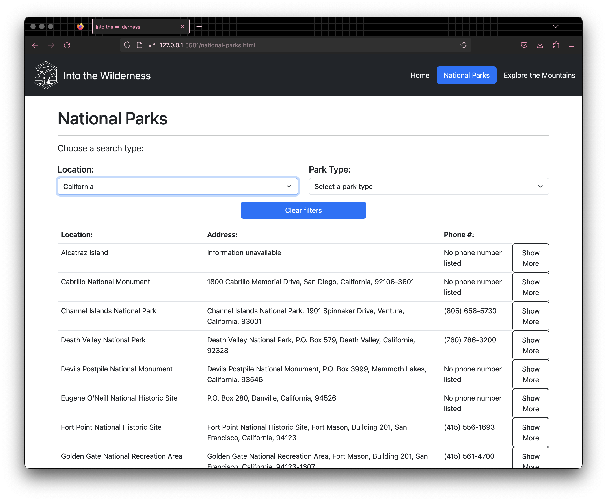
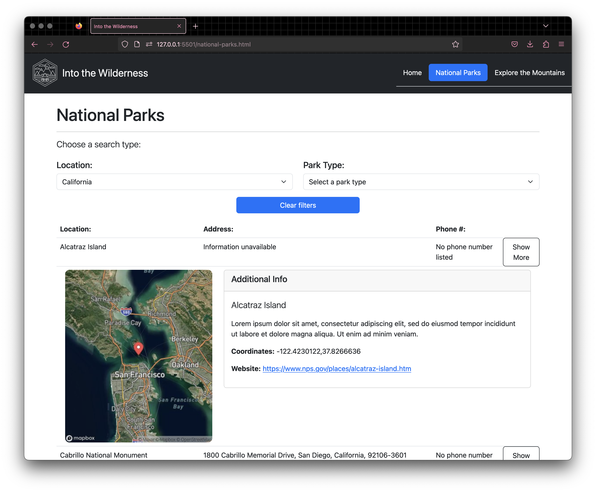
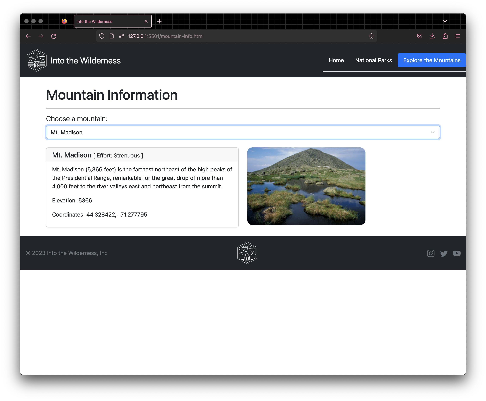

# outdoors-site-repo
'Enjoy the outdoors' National Parks Site

# Home Page
- The home page contains a navbar that is present throughout the site and it allows the user to navigate through the pages easily. The banner image also contains a button that takes the user to the national parks page when clicked. Finally, the section below contains two lorem paragraphs and an auto-playing carosuel image (with no indicators).

# National Parks

  - The 'National Parks' page allows users to choose a search type ('by Location' or 'by Park type') and view the filtered results in a table. The information isted in the tables contains the selected park's (if available): 
    - Name
    - Address (incl. city, state, and zip code)
    - Phone number
    - and a 'Show more' button

  - Upon clicking the 'Show more' button, the user is able to see map view of it's location (using Mapbox's Static Images API (https://docs.mapbox.com/playground/static/), as well as additinal information about the park:
    - A brief description (A lorem paragraph) 
    - Coordinates
    - and a website link for the selected park that opens a new tab.

# Mountain Info page

  - This page allows users to select from 48 different mountain options in a dropdown, and view corresponding information about the mountain:
    - The mountain's name
    - It's 'effort level' (the difficulty of the climb/hike)
    - A brief description
    - The mountain's elevation
    - as well as it's coordinates
  - Alongside that information, a picture is displayed that matches the mountain currently selected

## Sources for methods/solutions
- Centered text on top of an image: https://www.w3schools.com/howto/howto_css_image_text.asp 
- Show/hide specific table rows: https://stackoverflow.com/questions/73434657/show-hide-html-table-rows-using-javascript & my Pluralsight instructor (Ben Wihelm)
- Static map view API (Mapbox): https://docs.mapbox.com/playground/static/
- Dynamically creating cards in javascript: https://stackoverflow.com/questions/54706080/generating-dynamic-html-cards-from-a-javascript-array

